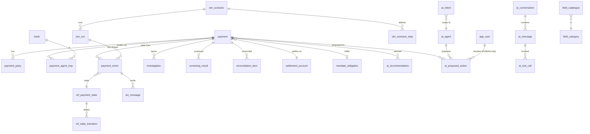

# Kuber V4 — Database Schema and Agent Data Layer

This package holds the complete data model behind the Kuber Payment Intelligence Command Center (`payment_intelligence_command_center_v4.html`). The database is built so the Kuber AI agent produces the same numbers, labels and state transitions as the HTML simulation.

## Files and load order

| # | File | Purpose |
|---|------|---------|
| 1 | `kuber_v4_postgres_schema.sql` | The system of record for PostgreSQL 15+, AlloyDB or Cloud SQL. It creates 71 tables, 13 views, 38 functions and 5 triggers, plus least-privilege roles. |
| 2 | `kuber_v4_seed.sql` | Seed data generated from the HTML: 68 payments, 450 lifecycle events, scenarios, the field catalogue, the agents and the radar snapshots. |
| 3 | `kuber_v4_smoke_tests.sql` | Assertions for a freshly loaded database. The script raises an error on the first failure. Run it on a fresh load, because it creates simulation runs as a side effect. |
| 4 | `kuber_v4_bigquery_analytics.sql` | BigQuery analytics layer: partitioned and clustered facts, Executive Radar views, and column descriptions that Gemini reads as context. |
| 5 | `kuber_v4_agent_tools.yaml` | Agent tool contract for MCP Toolbox for Databases: 15 tools and 7 per-agent toolsets. |
| 6 | `kuber_v4_data_dictionary.csv` | Every table, view column and function, with keys, foreign keys and descriptions. |

```bash
psql -v ON_ERROR_STOP=1 -d kuber -f kuber_v4_postgres_schema.sql
psql -v ON_ERROR_STOP=1 -d kuber -f kuber_v4_seed.sql
psql -v ON_ERROR_STOP=1 -d kuber -f kuber_v4_smoke_tests.sql   # NOTICE: ALL PASSED
```

## Recommended architecture (GCP)

```
 Payment platform / simulator UI
        │  events (append-only)
        ▼
 AlloyDB for PostgreSQL ── system of record ─────────────────────────────┐
   • payment_event stream → projection (fn_project_payment)              │ Datastream (CDC)
   • state-machine guard, human-approval guard, RLS-ready roles          ▼
   • semantic layer: v_payment_current, fn_payment_360, fn_kuber_*   BigQuery kuber_analytics
   • pgvector / ScaNN for RAG over ISO guidelines & runbooks          • radar, trends, drilldowns
        ▲                                                             • history, AI evaluation
        │  parameterised tools (MCP Toolbox for Databases)                  ▲
        │                                                                   │ bigquery-sql tools /
 Kuber agents (ADK on Gemini Enterprise Agent Platform / Vertex AI)  ───────┘ Conversational Analytics
   Orchestrator + 6 specialists · Gemini Pro tier (reasoning) · Flash tier (routing, summaries)
```

### Why PostgreSQL/AlloyDB is the system of record, not BigQuery alone

| Requirement from the command center | AlloyDB / PostgreSQL | BigQuery alone |
|---|---|---|
| Event-driven state machine; a new event every 170 ms at 10x speed | Transactions and triggers, millisecond writes | DML is asynchronous and rate-limited; not built for per-event OLTP |
| "A rejected payment can never show Completed" | Enforced: a guard trigger plus a transition table, and COMPLETED requires a pacs.002 ACCC | Keys and constraints are not enforced; the application would have to police this |
| Human-approval boundary | Enforced: `external_executed` CHECK, human-principal trigger, role grants | Policy tags and IAM only; no row-level write guards |
| Payment 360 in one call (<50 ms) | `fn_payment_360(id)` point lookup | Every query scans columns and costs money; latency is seconds |
| Seven-day radar, 8.7M payments/day, trend and ad-hoc analytics | Possible, but the wrong tool | Best fit: partitioned facts plus Conversational Analytics |

**Recommendation:** keep BigQuery, but use it as the analytics layer, fed by Datastream. Put the operational truth in AlloyDB. Cloud SQL for PostgreSQL is fine for development. Every SQL file here was tested on PostgreSQL 16 with pgvector.

At production volume (about 8.7M payments and 60M events a day), partition `payment_event` by month on `event_ts`. Keep about 90 days hot in AlloyDB and the full history in BigQuery.

## Choosing the LLM: is Gemini on BigQuery good enough?

Yes, with this design. Gemini Pro-tier models support tool calling and have long context windows. At the time of writing, Gemini 3.1 Pro is generally available on Vertex AI with a 1M-token window. That is more than enough for this agent. What decides whether the agent matches the HTML is how the data layer is exposed, not which model you pick:

1. **Deterministic tools, not free-form SQL, for operations.** The model calls `get_payment_360`, `kuber_answer`, `get_evidence` and similar tools. These tools compute the journey, status indicator, evidence, confidence (e.g. 0.94) and next actions in SQL, exactly as the HTML does. The model only explains the results.
2. **Text-to-SQL only on BigQuery semantic views**, such as `v_exec_radar_live` and `v_exceptions_by_reason`, where column descriptions guide Gemini.
3. **A gold-answer check.** `fn_kuber_answer()` is the deterministic reference answer. Log `matched_gold_answer` in `ai_interaction_fact` and review it regularly.
4. **Model-agnostic plumbing.** The tools are served over MCP, so you can swap in another model (for example Claude through Vertex AI Model Garden) and pick whichever scores best on your evaluation set. The 47 parity checks listed below make a ready-made evaluation set.

Suggested split:
- **Gemini Pro tier:** Orchestrator and Payment Investigator (multi-step reasoning).
- **Gemini Flash tier:** intent routing, summaries and the high-volume Monte Carlo narratives.
- **Gemini embeddings:** stored in `knowledge_chunk.embedding` for RAG.

## How each HTML feature maps to the database and tools

| HTML section | Tables | Agent tool / function |
|---|---|---|
| Executive Radar KPIs, donuts, type bars, trend | `exec_kpi_snapshot`, `exec_kpi_spark`, `exec_breakdown`, `exec_trend_daily` (live: `v_live_*`) | `get_exec_radar` (BigQuery) |
| Persona modes | `persona`, `persona_tag`, `column_preset*` | `search_payments(mode)` |
| Discovery fabric and field catalogue | `field_catalogue` (with `source_column`, `synonyms`, `iso_path_hint`), `nl_query_vocabulary`, `saved_view` | `search_payments`, `lookup_field` |
| Payment model | `payment`, `payment_party`, `payment_agent_hop`, `payment_charge` | `v_payment_current` |
| Payment 360: lineage, events, messages, parties | `payment_event`, `iso_message`, `ref_mt_mx_mapping` | `get_payment_360`, `get_lineage`, `get_payment_timeline`, `get_iso_chain` |
| Simulation engine | `sim_scenario`, `sim_scenario_step`, `sim_speed`, `sim_latency_profile`, `sim_run`; events carry `sim_run_id` and `iso_payload` | `fn_sim_start / step / pause / resume / inject_failure / reset` (human operator role) |
| Exceptions and operations | `payment_exception`, `investigation`, `screening_result`, `liquidity_position`, `reconciliation_item`, `sla_policy` | inside the 360 |
| Drilldowns and mandates | `customer_metric_daily`, `rail_metric_daily`, `mandate_obligation` | `get_mandates` |
| Kuber console | `ai_agent`, `ai_quick_prompt`, `ai_intent`, `ai_evidence_dimension`, `ai_action_rule`, `ai_conversation`, `ai_message`, `ai_tool_call`, `ai_evidence_item`, `ai_recommendation`, `ai_proposed_action` | `kuber_answer`, `get_evidence`, `get_proposed_actions`, `propose_actions` |
| Innovation Lab | `rail_route_rule`, `regulatory_item`, `mc_run`, `mc_outcome` | `route_rail`, `v_regulatory_horizon`, `v_address_readiness` |
| Governance | `app_user` (HUMAN / AGENT / SYSTEM), `audit_log`, roles `kuber_agent_reader`, `kuber_agent_writer`, `kuber_operator` | — |

## Core ERD



## Verification (run in this session)

- **HTML parity (47/47):** the seed data was extracted from the running HTML, and every derived value was compared with it:
  - all 68 payments: state label, status indicator, journey kind and target, gpi status, SLA, exception type, confidence, completeness, proposed actions and Kuber summary
  - all 4 scenarios plus a domestic run: every event's state, simulated latency, timestamp and actor, the final state, the ISO and exception counts, and the ISO event payload
  - the guards, role privileges, human-approval boundary, router, radar, mandates and regulatory horizon
- **Agent tools:** all 13 PostgreSQL tools in `kuber_v4_agent_tools.yaml` were executed under their least-privilege roles.
- **BigQuery:** the DDL and the two BigQuery tools parse as GoogleSQL. They have not been run against a live BigQuery project yet.

---
Synthetic data only. Nothing in this package executes payments or sends SWIFT, Fed or TCH messages.
